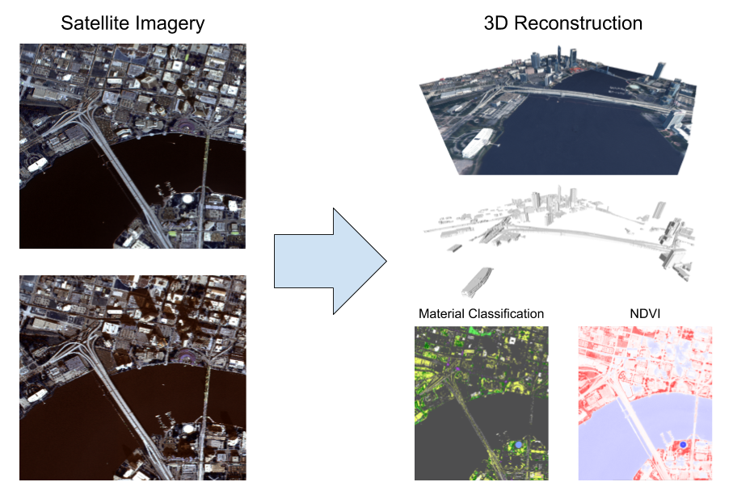

==========
Danesfield
==========

This repository addresses the algorithmic challenges of the IARPA CORE3D
program.  The goal of this software is to reconstruct semantically meaningful
3D models of buildings and other man-made structures from satellite imagery.

This repository contains the algorithms to solve the CORE3D problem, but the
user interface and cloud-based processing infrastructure are provided
in a separate project called Resonant Geo.  The algorithms in this repository
are written in Python or at least provide a Python interface.

Getting Started
===============

Clone repository
----------------

Clone this repository with its sub-modules by running:

.. code-block::

    git clone --recursive git@github.com:Kitware/Danesfield.git

To fetch the latest version of this repository and its sub-modules, run:

.. code-block::

    git pull
    git submodule update --init --recursive

Create Conda environment
------------------------

The first step in running or developing Danesfield code is to obtain the
correct development environment.  The Danesfield algorithms require a number of
dependencies on geospatial and computer vision libraries.  Provided with this
repository are instructions for configuring a development environment with
Conda.  Conda provides a consistent development environment with a known
configuration of dependencies versions.  Follow the directions in
`<deployment/conda/README.rst>`_ to setup this environment.

Docker image
------------

This repository has also been built into a Docker image, which
includes the required conda environment.  The image is available from
Docker Hub at `<https://hub.docker.com/r/kitware/danesfield>`_ and can
be pulled down by running ``docker pull kitware/danesfield``.  The
image was built using the Dockerfile included in this repository.

As some of the Danesfield algorithms require a GPU, you'll need to
have `NVIDIA Docker <https://github.com/NVIDIA/nvidia-docker>`_
installed, and use the ``nvidia-docker`` command when running the
image.

Project Layout
==============

The Danesfield project is organized as follows:

- `<danesfield>`_ This directory is where the danesfield algorithmic modules
  live.
- `<tools>`_ This directory contains command line tools to execute the
  Danesfield algorithms.

Run Danesfield CLI
==================

The Danesfield pipeline can be run from a command line using `tools/run_danesfield.py`
from a docker container.
- Ensure the latest danesfield docker image and nvidia-docker.
- Create/edit a danesfield configuration file `input.ini`
- Start an docker session with access to `tools/run_danesfield.py` and `input.ini`

.. code-block::

    nvidia-docker run -it --rm --gpus all --shm-size 8G\
     -v /$DATA/CORE3D:/mnt -v $HOME:/home/$USER -v /$WORK:/work\
     kitware/danesfield /bin/bash

- To execute a pipeline with a point cloud, run

.. code-block::

    python run_danesfield.py path/to/input.ini

- To execute a pipeline with a set of satellite images, run

.. code-block::

    python run_danesfield.py --image path/to/input.ini

Note: `input.ini` should contain a valid path to imagery via `imagery_dir`

Some Useful Resources
=====================

`GDAL/OGR cookbook <https://pcjericks.github.io/py-gdalogr-cookbook/>`_

`Workshop: Raster and vector processing with GDAL
<http://download.osgeo.org/gdal/workshop/foss4ge2015/workshop_gdal.pdf>`_
